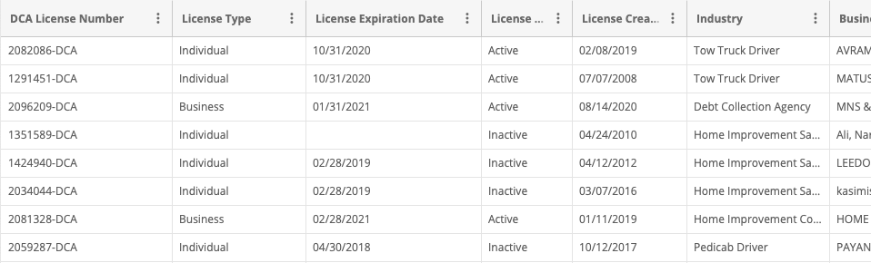
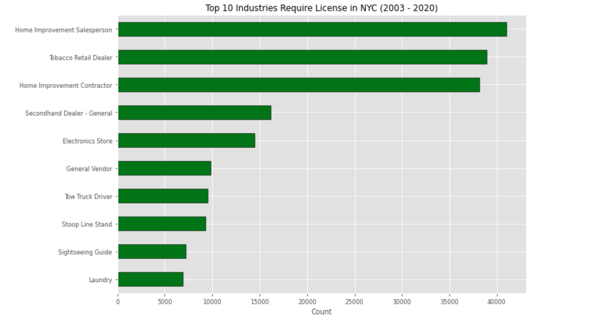
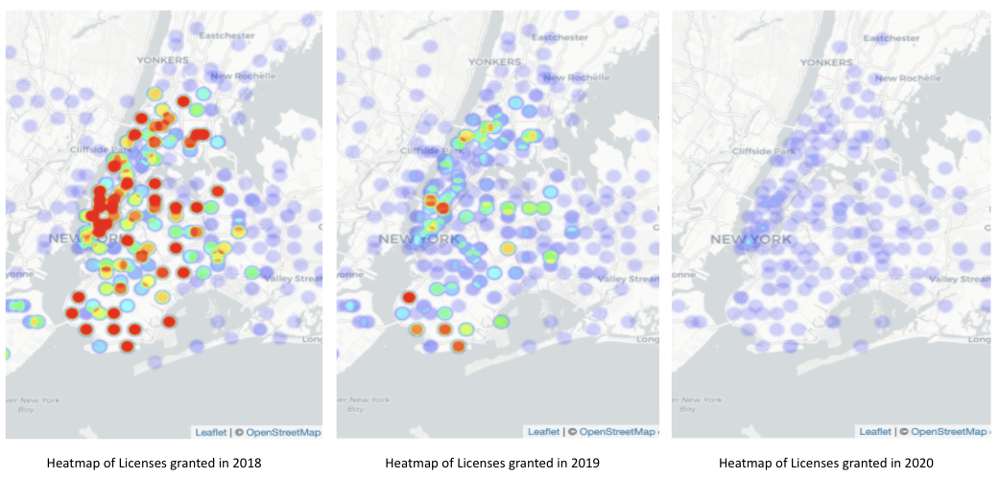
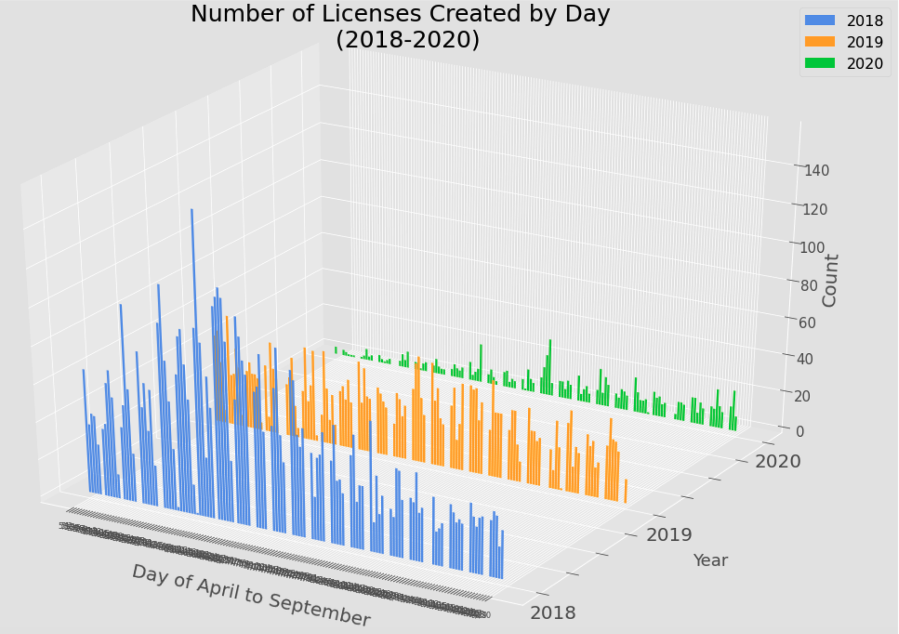

# NYC Legally Operating Businesses Analysis(Draft)

My analysis dives into the current NYC Legally Operating Businsses database. Does the number of new business licenses statisticaly significant drops this year compare to previous years? Among the top 10 industries that require licenses, which industry has the most drops in numbers of licenses created this year compared to previous two years?

* [Background Introduction](#background-introduction)
* [Data Information](#data-information)
    * [Data Gathering](#data-gathering)
    * [Data Cleaning](#data-cleaning)
    * [Data Visulization](#data-vissulization)
* [Hypothesis Testing](#hypothesis-testing)
* [Conclusion](#conclusion)
* [Future Analysis](#future-analysis)

## Background Introduction
The Department of Consumers Affairs (DCA) enforces the Consumer Protection Law and other related business laws throughout New York City. Ensuring a fair and vibrant marketplace for consumers and businesses, DCA licenses more than 71,000 businesses in 57 different industries. Through targeted outreach, partnerships with community and trade organizations, and informational materials, DCA educates consumers and businesses alike about their rights and responsibilities.

## Data Information
This data set features businesses/individuals holding a DCA license so that they may legally operate in New York City. It contains information of the NYC department of consumer affairs issued licenses from 2003 to 2020.

  

### Data Gathering:

  

Data used for this analysis was gathered from NYCOpenData website.

1)  Downloading:  The dataset was downloaded from NYCOpenData website.The raw data is about 62 MB with 27 features and more than 260 thousand observations.
2)  Transform:  It was transformed into a clean pandas dataframe for future analysis.

### Data Cleaning:
Data used in the study included DCA License Number, Type(Individual/Business), License Creation/Expiration Date, Industry, and the localtion informations about the business, ie: City, Zipcode, and coordinate in NYC from April 2018 to September 2020.

### Data Visulization:
By observing the original dataset I found out that there are 57 industries requires a DCA license in order to perform business in NYC area.
So I started off by generating a bar graph to show the top 10 industries that require license in NYC from 2003 to present by using Matplotlib.

  

As mentioned in data cleaning section, I choose to focus on new license created of the past 3 years since the data are more recent. I narrowed down the range of my dataset to the month of April to September which is the same time interval for the pandamic outbreak.From the heatmap you can see there is a drop of numbers of new license being granted from the year of 2018 to 2020.

  

## Hypothesis Testing
By observing the 3D bar graph I created using matplotlib, I was able to observe that the number of new license being granted in 2020 is dropped drasticly compared to the previous two years.

  

I would like to find out whether or not the drop is statistically significant.So I conducted a hypothesis testing by following steps below:

###### Step 1: Set up the hypothesis
The null hypothesis is that the mean of licenses granted in 2020 has no change comparing to the mean of licenses granted in previous years(2018 and 2019).

Alternative hypothesis is that there is a significant difference to the mean value of new DCA License granted.

>**H0: μ = μ 0**

>**H1: μ ≠ μ 0**

###### Step 2: Select test statistic
To test this hypothesis the t-test was chosen.
The significance level was set at: 0.05

The Welch's t-test, does not assume the two populations from which the samples are drawn have the same variance.

###### Step 3: Set up decision rule
Reject the null hypothesis if p-value is less than our threshold alpha=0.05.

###### Step 4: Compute the test statistic

## Conclusion
Given the results of our test we conclude that we must reject the null-hypothesis.  There is enough evidence to say that the number of new DCA license being granted was dropped comparing to the number of new DCA license granted from the previous two years. 
The t-statistics of 14.678045591103883 with a p-value of 3.2720431903438374e-32 well below our 0.05 significance level. 

  

  

From the graphs above we can easily conclude that there is a significant drop of new license granted number bertween 2020 and the previous years.

## Future Improvements
• Analysis of changes in new licenses granted by different industry. 
• Bring covid-19 data to analyze correlation between new license granted number declined and the covid-19 outbreak. 

